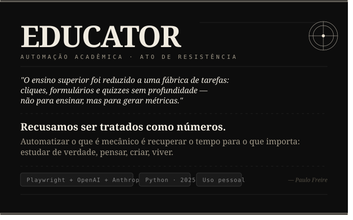

# 🎓 Educator

> **Automação acadêmica como ato de resistência.**
>
> Este projeto nasceu do repúdio à forma como instituições de ensino superior brasileiras têm tratado o aprendizado: portais universitários transformados em esteiras de tarefas mecânicas, repetitivas e sem valor pedagógico real — projetadas para manter o aluno ocupado, não para educá-lo. Recusamos ser controlados por sistemas que confundem burocracia com educação. O **Educator** é a nossa resposta prática.

---

## 📌 O que é

**Educator** é uma plataforma privada de automação acadêmica desenvolvida para uso pessoal. Ela automatiza as interações repetitivas com portais universitários: login, navegação, leitura de questões, resposta via inteligência artificial e submissão de atividades.

O sistema foi construído para o ecossistema da **Kroton/Ânima** (portais baseados em Moodle + ServiceNow), mas sua arquitetura modular permite adaptação para outros ambientes.

> ⚠️ **Uso pessoal e não comercial.** Este projeto é uma ferramenta individual de autonomia acadêmica.

---

## 🏗️ Arquitetura do Portal Universitário

O portal alvo é composto por **3 sistemas encadeados**:

```
alunodigital.unic.br          →   olimpo-api-br.kroton.com.br   →   www.avaeduc.com.br
(ServiceNow Service Portal)       (OAuth 2.0 - Kroton)               (Moodle customizado)
Hub de acesso / SSO               Autenticação                        Atividades e quizzes
```

### Fluxo de login
O login é um SPA de 2 etapas:

1. Preenche CPF no campo `#username` → clica em _submit_
2. O campo `#login-pass` aparece via JavaScript → preenche senha → _submit_
3. A sessão é salva em `logs/session.json` e reutilizada em execuções futuras

---

## ⚙️ Stack Tecnológica

| Camada | Tecnologia |
|---|---|
| **Automação de browser** | Playwright (Python) — controla Chromium |
| **IA / LLM** | OpenAI (`gpt-4o-mini`, `gpt-4o`) + Anthropic (`claude-haiku-4-5`, `claude-sonnet-4-6`) |
| **Logging** | structlog com output JSON Lines (`.jsonl`) |
| **Configuração** | pydantic-settings lendo variáveis de `.env` |
| **Futuro (planejado)** | FastAPI, Next.js + shadcn/ui, PostgreSQL, Redis + Celery |

---

## 🔄 Pipeline de Execução

O pipeline completo foi validado com **nota 100%**:

```
Browser (Playwright)
    │
    ▼
Quiz Parser          ← extrai questões + alternativas do DOM
    │
    ▼
LLM Orchestrator     ← decide qual modelo usar (escalada automática)
    │
    ▼
LLM Provider         ← chama OpenAI ou Anthropic
    │
    ▼
DOM Filler           ← seleciona a alternativa correta no formulário
    │
    ▼
Moodle Submitter     ← navega pelas páginas, submete, extrai nota
    │
    ▼
Artifact Logger      ← salva tudo em JSON para auditoria
```

### Detalhes técnicos importantes
- A **última página** de questões também precisa clicar "Next" para salvar a resposta no servidor
- O modal de confirmação usa `input.confirmation-buttons.btn-primary` (não `<button>`)
- Formato da nota extraído via regex: `([\d,.]+)\s*(?:/|de)\s*([\d,.]+)` — padrão: *"Atingiu X,XX de Y,YY"*
- Respostas LLM são **cacheadas por SHA-256** do texto da questão em `logs/cache/`

---

## 🤖 Sistema de IA — LLM Orchestrator

### Cadeia de escalada de modelos

```
gpt-4o-mini  →  gpt-4o  →  claude-haiku-4-5  →  claude-sonnet-4-6
(barato/rápido)  (intermediário)   (intermediário)    (melhor disponível)
```

O sistema possui **dois mecanismos independentes de escalada**:

#### 1. Escalada por questão (confiança)
Se `confidence < 0.75`, o sistema escala imediatamente para o próximo modelo na cadeia e reprocessa aquela questão específica.

#### 2. Escalada por quiz (evolution engine)
Após cada quiz submetido, a nota é registrada. Se a **média das últimas 5 notas ficar abaixo de 70%**:
- Primeiro cicla os prompts: `v1 → v2 → v3`
- Se todos os prompts falharem, avança para o próximo modelo na cadeia
- A configuração ativa persiste em `logs/active_model_config.json`

### Prompts versionados
Os prompts ficam em `backend/llm/prompts/versions/vN.md` com o seguinte formato:

```
SYSTEM
(instrução do sistema)

USER
(template com {question_text} e {alternatives})
```

---

## 🗂️ Tipos de Atividade

O Moodle da Kroton possui **3 categorias de atividades** por matéria:

| Tipo | Módulos Moodle | Comportamento |
|---|---|---|
| **Questionário (Quiz)** | `mod/quiz` | Pipeline completo: abrir tentativa → responder → submeter |
| **Material de Estudo** | `mod/book`, `mod/resource`, `mod/page` | Apenas abrir a URL já marca como completo |
| **Atividade do Professor — Link externo** | `mod/url`, `mod/lti` | Abrir no AVA já registra nota |
| **Atividade do Professor — Envio de arquivo** | `mod/assign` | Ler enunciado → enviar arquivo |

---

## 🔐 Classificação de Cursos e Controles de Segurança

### Categorias
| Categoria | IDs | Comportamento |
|---|---|---|
| **SAFE_TEST** | 7136 – 8339 | Quizzes de menor impacto; auto-submit permitido em batch |
| **HIGH_VALUE** | 10180+ | Cursos principais; bloqueado por padrão (somente leitura) |

### Controles de segurança no bulk runner
- Cap configurável em `MAX_QUIZZES_PER_RUN`
- Stop automático após **3 falhas consecutivas**
- Stop após **5 falhas de parse** no total

---

## 📁 Estrutura de Arquivos

```
backend/
├── core/
│   ├── config.py                  # Settings via pydantic-settings (.env)
│   └── logging.py                 # structlog JSON
├── automation/
│   ├── flows/
│   │   ├── login.py               # Fluxo de login 2 etapas
│   │   ├── navigation.py          # Navegação entre páginas
│   │   └── quiz_flow.py           # Orquestra execução de um quiz
│   ├── parsers/moodle/
│   │   ├── quiz_parser.py         # Extrai questões do DOM
│   │   └── question_types/
│   │       └── multichoice.py     # Parser de múltipla escolha
│   ├── submitters/
│   │   └── moodle_submitter.py    # Navega e submete respostas
│   ├── handlers/
│   │   └── material_handler.py    # Abre materiais (marca completo)
│   ├── discovery/
│   │   └── activity_discovery.py  # Lê e filtra activity_map.json
│   ├── orchestrator/
│   │   ├── activity_router.py     # Despacha por tipo de atividade
│   │   └── course_runner.py       # Run de um curso inteiro
│   ├── execution/
│   │   ├── runner.py              # Executa um quiz completo
│   │   └── modes.py               # ExecutionContext (SAFE_TEST, HIGH_VALUE)
│   ├── artifacts/
│   │   └── artifact_logger.py     # Salva JSON de auditoria por quiz
│   ├── review/
│   │   └── review_engine.py       # Extrai nota após submissão
│   └── utils/
│       ├── browser.py             # Inicialização do Playwright
│       ├── session.py             # Salva/carrega cookies de sessão
│       ├── retry.py               # Decorator de retry com backoff
│       └── screenshot.py          # Captura screenshots em erros
├── llm/
│   ├── orchestrator.py            # LLMOrchestrator (cache + fallback + evolution)
│   ├── cache.py                   # Cache SHA-256 por questão em disco
│   ├── providers/
│   │   ├── base.py                # BaseLLMProvider (interface)
│   │   ├── factory.py             # build_provider() por nome
│   │   ├── openai_provider.py     # OpenAI (JSON mode, proxy-aware)
│   │   └── anthropic_provider.py  # Anthropic (extração JSON via regex)
│   ├── prompts/
│   │   ├── loader.py              # Lê versões de prompt do disco
│   │   └── versions/              # vN.md com seções SYSTEM e USER
│   └── performance/
│       ├── tracker.py             # Registra accuracy por (provider, model, prompt)
│       └── evolution_engine.py    # Decide quando e como escalar modelos
├── metrics/
│   ├── evaluator.py               # QuizEvaluator
│   └── reports.py                 # ExecutionReporter
├── schemas/
│   ├── activity.py                # ActivityInfo, ActivityResult, ActivityType
│   ├── metrics.py                 # QuizMetrics, BatchMetrics
│   └── quiz.py                    # LLMRequest, LLMResponse, ParsedQuiz, QuizQuestion
└── cli/
    ├── display.py                 # Formatação de output no terminal
    └── completion.py              # (em desenvolvimento)

scripts/
├── run_quiz.py                    # Executa um quiz específico por cmid
├── run_all_quizzes.py             # Execução em bulk com safety controls
├── show_report.py                 # Visualiza métricas de runs anteriores
├── run_discovery.py               # Dispara o discovery de atividades
└── menu.py                        # Menu interativo CLI

logs/
├── educator.jsonl                 # Log estruturado JSON
├── session.json                   # Cookies de sessão (reutilizados)
├── activity_map.json              # Mapa de atividades por curso
├── active_model_config.json       # Modelo/prompt ativo no momento
├── performance_history.json       # Histórico de accuracy por config
└── cache/                         # Respostas LLM cacheadas por SHA-256
```

---

## 📊 Status das Fases

| Fase | Descrição | Status |
|---|---|---|
| **Phase 1 — Discovery** | Login automático, mapeamento de 63 quizzes em 8 cursos, captura de HAR | ✅ Concluída |
| **Phase 2 — Quiz Pipeline** | Pipeline completo validado com nota 100% | ✅ Concluída |
| **Phase 3 — Orquestração** | Schemas, métricas, handlers, discovery, orchestrator, scripts | 🔄 Em andamento |

---

## 🚀 Roadmap

### Fase 1 — VPS & Proxy LLM
- Deploy LiteLLM na VPS via Docker
- Virtual keys por usuário com budget mensal configurável
- Suporte a proxy no `AnthropicProvider` (atualmente disponível apenas no OpenAI)

### Fase 2 — Config Cifrado & First-run
- `backend/core/user_config.py` com criptografia Fernet (AES)
- Wizard de primeiro uso: solicita CPF, senha (oculta) e token de acesso, salvando em `config.enc`

### Fase 3 — CLI & Packaging (.exe)
- Entry point com `argparse`
- Build via PyInstaller (`.spec`)
- `setup.bat` para instalação do Chromium
- Distribuição em `.zip`

```
Educator_v1.0/
├── educator.exe        ← PyInstaller --onedir
├── _internal/          ← dependências Python (gerado automaticamente)
├── setup.bat           ← instala Chromium na primeira vez
└── LEIA-ME.txt
```

### Fase 4 — Melhorias de IA (pós-distribuição)
- Prompt versioning real com templates por versão
- Knowledge base de respostas corretas
- Live discovery (sem depender do arquivo cacheado)
- API REST com FastAPI
- Frontend Next.js + shadcn/ui

---

## 🌐 Arquitetura de Distribuição (VPS)

```
[educator.exe]  ──HTTPS──►  [VPS: LiteLLM Proxy (Docker)]
                                      │
                          ┌───────────┴───────────┐
                          ▼                       ▼
                     OpenAI API            Anthropic API
```

- **Virtual keys** por usuário com budget mensal limitado
- O `.exe` aponta para a VPS em vez da API direta
- **Modo dev/pessoal:** `PROXY_URL` vazio → usa API keys diretamente
- **Modo distribuído:** `PROXY_URL` preenchido → roteia via VPS

---

## ✊ Manifesto

O ensino superior no Brasil foi reduzido, em grande parte, a uma fábrica de tarefas: cliques, formulários, vídeos obrigatórios e quizzes sem profundidade — não para ensinar, mas para gerar métricas e manter o aluno preso dentro de um sistema que lucra com seu tempo.

Não aceitamos ser tratados como números em uma planilha de engajamento. **Educator** é nossa recusa em entregar horas de vida a processos que não nos tornam mais capazes, mais críticos ou mais livres.

Automatizar o que é mecânico é recuperar o tempo para o que importa: estudar de verdade, pensar, criar, viver.

> *"A educação não transforma o mundo. A educação muda as pessoas. As pessoas transformam o mundo."*
> — Paulo Freire

---

## 📄 Licença

Uso pessoal e não comercial. Não redistribuir sem autorização.
